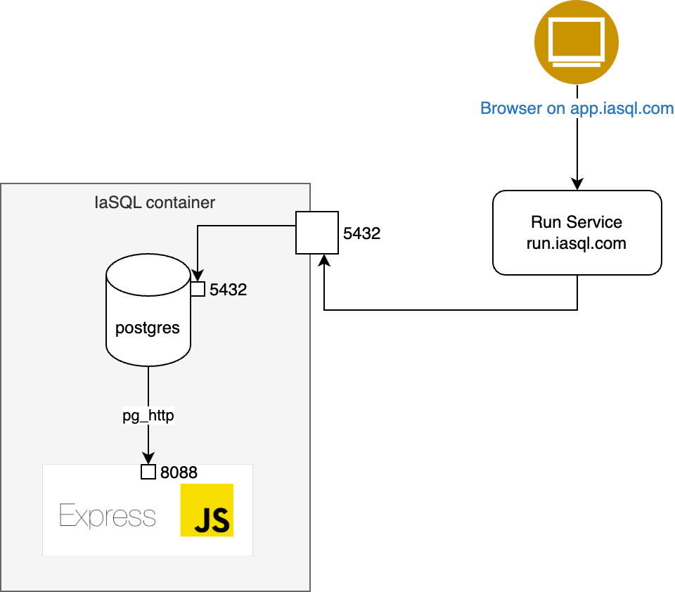

# Dashboard

SPA for the IaSQL dashboard. This project was bootstrapped with [Create React App](https://github.com/facebook/create-react-app) and the TailwindUI examples https://tailwindui.com/components/application-ui/. It also uses Flux to manage state management roughly as described [here](https://www.freecodecamp.org/news/how-to-use-flux-in-react-example/)

## Debugging CI failures

Playwright trace and screenshots get uploaded to GH actions https://github.com/actions/upload-artifact#where-does-the-upload-go. Download artifact and upload to https://trace.playwright.dev

## Available Scripts

In the project directory, you can run:

### `yarn start`

Runs the app in the development mode.\
Open [http://localhost:3000](http://localhost:3000) to view it in your browser.

The page will reload when you make changes.\
You may also see any lint errors in the console.

### `yarn test`

Launches the test runner in headless mode

### `yarn debug-test`

Launches the test runner in headed mode and launches the [Playwright Inspector](https://playwright.dev/docs/inspector)

### `yarn gen-test`

Opens a localhost:3000 in headed mode and [generates a test](https://playwright.dev/docs/codegen) by recording all actions performed using the [Playwright Inspector](https://playwright.dev/docs/inspector)

### `yarn run build`

Builds the app for production to the `build` folder.\
It correctly bundles React in production mode and optimizes the build for the best performance.

The build is minified and the filenames include the hashes.\
Your app is ready to be deployed!

See the section about [deployment](https://facebook.github.io/create-react-app/docs/deployment) for more information.

## Issues

- React hot reload was thowing an error in the web console: `ReferenceError: Cant't find variable: process`. Solution applied: https://stackoverflow.com/questions/70357360/process-is-not-defined-on-hot-reload. Take this into account for future dependencies upgrades.

## How Is IaSQL Front-End Communicating The Database?

If the only thing the IaSQL container exposes is the `5432` port which is a Postgres port, so how does the IaSQL dashboard communicate with it?

We have created a `run` service (listening on `https://run.iasql.com/` - under [run folder](./run) in this repo) which is taking the requests from the users and communicating with the IaSQL container's Postgres port. It's basically an "HTTP to Postgres" service with authentication and a bit of additional spices.

