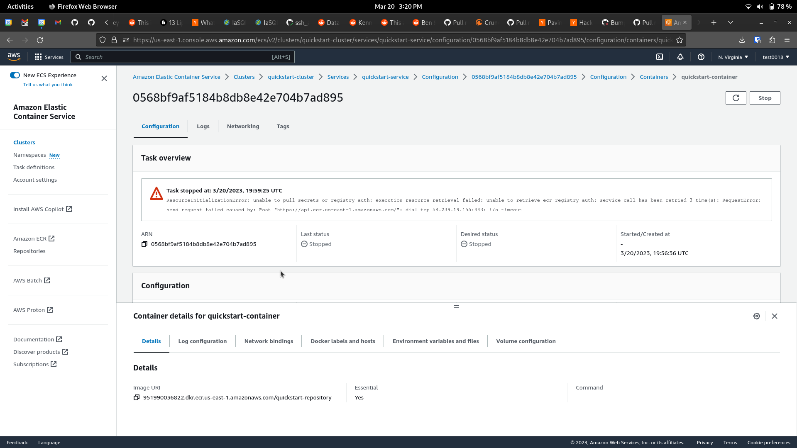

# 006 - Postmortem for internet gateway route being deleted from the default vpc's route table

## Level: Internal

## Author(s)

- Alejandro Guillen <alejandro@iasql.com>

## Summary

The internet gateway route have being deleted from the default vpc's route table by the `delete_all_records` method on test accounts. This has been an issue in the past for Codedeploy but something changed in AWS over the weekend (March 17th-19th) that made the failure appear on tutorials tests (Django and Prisma) blocking the whole test suite.

## Timeline

- **2023-03-20**: test suite degradation. Mainly Codedeploy.
- **2023-03-21**: test suite failing almost on every run for tutorials.

## Detection

The tutorial tests start failing recurrently despite the retry attempts. @dfellis decided to dig in and realized it was a network issue between ECS and ECR. Since we were already trying to handle the issue for Codedeploy it makes sense to relate both issues. So we did and look for the network configuration for an account where the tutorials were failing and found the internet gateway route absence.

While debugging, @dfellis found [this](https://repost.aws/knowledge-center/ecs-unable-to-pull-secrets) that has the following text:

> The [AWS Fargate platform version 1.4.0](https://docs.aws.amazon.com/AmazonECS/latest/developerguide/platform-linux-fargate.html#platform-version-1-4) uses the task elastic network interface to pull the image and secrets. All network traffic flows through the elastic network interface within your Amazon Virtual Private Cloud (Amazon VPC).

It goes on to say that with 1.4.0 of Fargate it no longer has its own built-in link to ECR, so you need to make sure your VPC has access to the ECR repository you're using, which matches the error message in this screenshot:

## Response

@mtp1376 started on March 20th a PR to fix Codedeploy avoiding the routes from the default vpc's route table being deleted, test were failing though, so it was not merged. On Tuesday after @dfellis' analysis and arriving at the conclusion that was the internet gateway route issue, we brought over the line @mtp1376's PR and then run a script to restore the internet gateway route on all test accounts. 

## Cause

Firstly, the `delete_all_records` function was deleting the internet gateway record for the default vpc's route table. Secondly, something has changed in AWS and this becomes an issue between the ECS and ECR communication, likely the change in version 1.4.0 of Fargate.

## Prevention

- Already added the fix to avoid this route being deleted.
- Already run the script to restore all the test accounts.
- We should be able to let users delete the default AWS configuration. For this, we should remove the logic from our mappers preventing users from it and move it to our clean accounts script. We also need to create a "restore_account_defaults" function or script to restore our test accounts to a default state once we deleted all records from it. The latter should be an RFC since there are different alternatives to how we can achieve it and different aspects to have into consideration.
