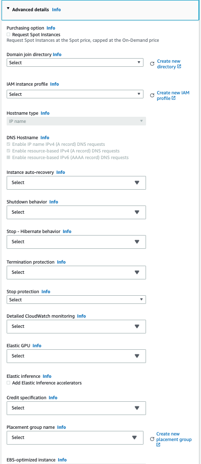

# 001 - EC2 Schema

## Current Status

### Proposed

2022-07-18

### Accepted

YYYY-MM-DD

#### Approvers

- LuisFer De Pombo <luisfer@iasql.com>
- David Ellis <david@alantechnologies.com>
- Yolanda Robla <yolanda@iasql.com>

### Implementation

- [ ] Implemented: [One or more PRs](https://github.com/iasql/iasql-engine/some-pr-link-here) YYYY-MM-DD
- [ ] Revoked/Superceded by: [RFC ###](./000 - RFC Template.md) YYYY-MM-DD

## Author(s)

- Alejandro Guillen <alejandro@iasql.com>

<!-- TODO: WIP -->
## Summary

Adding new features to get closer to the goal of the EC2 module's completeness adds more complexity to the model. The `instance` table is the core of the `aws_ec2` module and is the one that can get affected the most. This complexity have a direct impact on the user experience, especially for new users, since they can feel overwhelmed if they encounter a complicated model.

The definition of a solid base now will imply that new features added to this module will not translate into breaking changes to the model.

Taking a look at the AWS EC2 console options, we would still need to add the following to reach EC2 module completeness:

- Instance types with Availability zone relationship
- Launch templates
- Spot instances
- Dedicated hosts
- Saving plans
- Reserved instances
- Scheduled instances
- Capacity reservations
- Auto Scaling Groups
- AMIs management
- EBS volume snapshots and life cycle
- Placement groups
- Key Pairs
- Network interfaces

The `instance` table still needs more advance options to be defined. Some of those missing properties are: instance auto-recovery, shutdown behaviour, stop - hibernate behaviour, termination protection, stop protection, detailed cloudWatch monitoring, elastic GPU, credit specification, tenancy, RAM disk ID, kernel ID or Metadata accessible (I might be missing others). Aditionally, some of the features listed above will need to be added to the `instance` table as FKs.

The current EC2 model looks like this:

Note: Could be also accessed via https://dbdocs.io/alejandro/iasql

## Proposal

After considering alternatives like splitting everything into more modules, or having different `instance` tables around based on how they were created, the proposal is to keep growing the schema as we have been doing in this same module, but adding the relationships where they belong and rely on the instance metadata for the ones that are not needed for the CRUD of the `instance` table.

Let's go through all the needed features, see their implications in the model and get a final version of the ECS schema.

- Creating an instance using the UI/API let you add some advanced configuration, that usually is not used but is there. Showing a screenshot of part of it, but this would mean adding at least 12 columns (instance auto-recovery, shutdown behaviour, stop - hibernate behaviour, termination protection, stop protection, detailed cloudWatch monitoring, elastic GPU, credit specification, tenancy, RAM disk ID, kernel ID or Metadata accessible) to the `instance` table.

- Instance types depend on availability zones. We need to create a table relating them using a composite key. We also need to add the `availability_zone` column to the `instance` table to be able to the new `instance_type` table using the composite key.

- Launch templates will be a new table and need to be an `instance` table input column `launch_template_id`. If we insert other values to the `instance`, these will override the launch template ones. To be able to know if an instance was created using one of them we check the tags and look for the id to link the FK.

- Spot requests can be created manually, using launch templates or can be created by other entities like ASG or the same instance. If an instance was created using a spot request should not affect the `instance` table, so the relationship between them will be part of the `instance_metadata`. To be able to know if an instance was created by a spot request we check the tags and look for the id to link them.

- Dedicated host. These are physical servers fully dedicated by instance type and availability zone. Instances can be assigned to run in a dedicated host. The instance table will have an FK to this table.

- Capacity reservations. Let the users create a reservation of an instance type per availability zone. The implementation of this one can be tricky since once defined there are some options. An instance can define what CR use, or be assigned automatically if matches with a current instance or is assigned during the CR creation process if I'm not wrong. We might need to use the tags in the instance to add the right FK value to the CR when reading from the cloud.

- EBS Snapshots. They can be created from an existing running instance or a volume and then used during the EBS volumes creation. This table will have FKs to both `instance`s and `volume`s.

- Data Lifecycle Manager: Automate the creation, retention, copy and deletion of snapshots and AMIs. Snapshot target types could point to instances and volumes. This service targets resources by tags. We could be opinionated here and create join tables relating instances and volumes with these policies and automatically create the tags for them. The other option is to ignore the relationships at the DB level and just create the policies alone.

- Placement groups. Strategies to launch instances close together, partitioned or spread. Once the strategy is in place, an `instance` can be launched using one of these. This means the instance table will need a new FK for this service.

- Key Pairs. They can be assigned to an instance on creation time, so another FK column from the `instance` table to the key pair.

- Network interfaces. Logical network components. An ENI belongs to an instance, but an instance can have multiple ENIs (similar to EBS). So the FK in this case will be on the ENI's side.

- Auto Scaling Groups can be created manually, using launch templates (and launch configurations that are like launch templates just for ASG?) or can be created by other entities like EKS. Like spot requests, ASGs should not have a direct relation with `instance`s and can be part of the `instance_metadata`. To be able to know if an instance was created by an ASG we check the tags and look for the id to link them.

- AMI's management: This can be complex, not only in performance and how we have experienced it before, but also an AMI can be owned by yourself or someone else, you can check for yours or third parties. They can be private or public. I've been thinking that maybe they should be their module but if we implement this it makes sense to stay in the EC2 module since the instance directly relates to the AMI in use.

- Saving plans. Budget solution. Is not related only to EC2, but to Fargate and Lambda too. Commitment to a consistent amount of usage (measured in $/hour) for a 1 or 3-year term. The flow is similar to a marketplace. Maybe need its module? I do not foresee direct relation with any entity of the aws_ec2 module. In the AWS Console UI, it appears under EC2 but seems to be part of the AWS Cost Management service.

- Scheduled instances. Another marketplace-like service. The desired schedule needs to be set and then based on that you can see the offering, put it in your cart and then buy them.

- Reserved instances. also a budget solution with a supply and demand-like model. You insert the requirement you want and then you can see the offering. Based on that offering you can pick and buy. It is like parking spaces, you have reserved one instance type and then when you create one that matches the specifications will be taken into account for the cost.

After all these features, the EC2 schema should look something like the following:

Note: This schema does not have all the possible relationships, but the most important ones with the `instance` table.
Note 2: Could be also accessed via https://dbdocs.io/alejandro/proposed-iasql?view=relationships

Some of the features exposed do apply changes automatically to the cloud, like spot instances and Auto Scaling Groups. These will imply the development of the "safer sync faster apply" feature as a pre-requisite.

### Alternatives Considered

- Create different modules for the services that can manage AWS instances.
- Create different tables within the same `aws_ec2` module for the services that can manage AWS instances.

These two were discarded since they will increase the complexity of the model. Users will need to find all the tables that can contain `instance` information.

- Let iasql modules dynamically add/remove tables/columns based on module's "capabilities" selected by the user.

This option is not viable since it will be really hard to maintain and make it compatible through versions. It will imply the need for several opinionated decisions in behaviour that could not be expected by the users. Also, new users may not understand what capabilities are and add all of them every time.

## Expected Semver Impact

<!-- TODO -->
Patch version

## Affected Components

- `aws_ec2` module
- `aws_ec2_metadata` module
- `aws_vpc` module

## Expected Timeline

<!-- TODO -->
