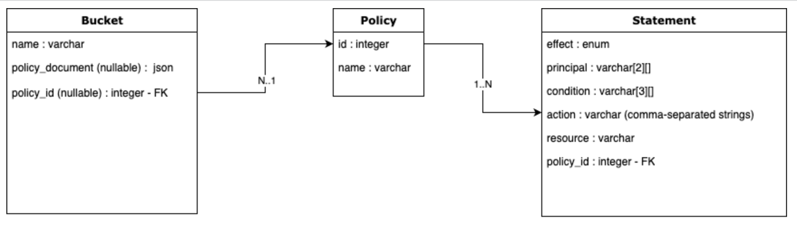

# 004 - Better Policy UX RFC

## Current Status

### Proposed

2022-09-06

### Accepted

YYYY-MM-DD

#### Approvers

- Full Name <email@example.com>

### Implementation

- [ ] Implemented: [One or more PRs](https://github.com/iasql/iasql-engine/some-pr-link-here) YYYY-MM-DD
- [ ] Revoked/Superceded by: [RFC ###](./000 - RFC Template.md) YYYY-MM-DD

## Author(s)

- Joseph <joseph@iasql.com>

## Summary

Customers (even the very technically experienced ones) often have to look up how to construct an AWS IAM policy and then spend time validating the policy before inserting into IaSQL.
This becomes more and more unmanageable as the policy grows.
This is not a good experience, and it can be improved upon. We believe we can collect some inputs from IaSQL customers and offer then some form of automation when creating policies, so they can do it faster, more confidently and more conveniently.

## Proposal

We should add new `Policy` and `Statement` entities (perhaps in the `aws_iam` module). These entities would serve as 
a way to construct IAM policies in a more user-friendly way. For example, the customer intends to create an S3 bucket with
read-only permissions from all Principals within the same AWS account. Ideally, something like this:

```json
{
  "Version": "2012-10-17",
  "Statement": [
    {
      "Effect": "Allow",
      "Resource": "aws:arn:123456789012:bucket-resource",
      "Action": [
        "s3:GetObjects"
      ],
      "Principal": {
        "AWS": "arn:aws:iam::123456789012:root"
      }
    }
  ]
}
```

Instead of the customer having to look up and put together a JSON blob like this and then verifying and then inserting, we can also give them
the option to do this using functions that would generate this blob.

```sql
-- User creates policy
select * from iasql_create_policy(
    'some_policy_name',
    '2012-10-17' -- nullable, defaults to 2012-10-17
    );

-- User creates statement and attaches to the policy
select * from iasql_create_policy_statement(
        '<policy_id>',
        'allow',
        'aws:arn:123456789012:bucket-resource',
        's3:GetObjects', -- comma separated list of actions
        '123456789012' -- comma separated list of principals
    );

-- User creates bucket with the policy
insert into bucket (
                name,
                policy_document, -- nullable if policy_id is provided
                policy_id -- nullable if policy_document is provided
            ) values ('some_bucket', NULL, '<policy_id>'); -- triggers a function that would generate the policy document, given the policy_id and store in the policy_document field
```

Perhaps these functions could even be used together like so
    
```sql
-- User creates bucket with the policy
insert into bucket (
                name,
                policy_document, -- nullable if policy_id is provided
                policy_id -- nullable if policy_document is provided
            ) values (
                      'some_bucket',
                      NULL,
                      iasql_create_policy( -- returns policy ID after creation
                          'some_policy_name',
                          '2012-10-17', -- nullable, defaults to 2012-10-17
                          iasql_create_policy_statement -- returns policy statement ID after creation
                            '<policy_id>',
                            'allow',
                            'aws:arn:123456789012:bucket-resource',
                            's3:GetObjects', -- comma separated list of actions
                            '123456789012' -- comma separated list of principals
                            ), -- Statement 1
                          iasql_create_policy_statement(...), -- Statement 2
                          ...
                          iasql_create_policy_statement(...) -- Statement N
                    );
```

### ER diagram for s3 example


And for Updating, we can equally have something like this:

```sql
UPDATE bucket set policy_id = iasql_create_policy( -- returns policy ID after creation
                              'some_policy_name',
                              '2012-10-17', -- nullable, defaults to 2012-10-17
                              iasql_create_policy_statement -- returns policy statement ID after creation
                                '<policy_id>',
                                'allow',
                                'aws:arn:123456789012:bucket-resource',
                                's3:GetObjects', -- comma separated list of actions
                                '123456789012' -- comma separated list of principals
                              ), -- Statement 1
                              iasql_create_policy_statement(...), -- Statement 2
                              ...
                              iasql_create_policy_statement(...) -- Statement N
                        ) WHERE id = '<bucket_id>';
```

These functions can be used to create policies for any AWS service (SQS, VPC, SNS etc.). We can also add more functions to create policies for
services in other clouds like GCP, Azure (out of scope).

Now, once the JSON blob is generated from the `Policy` and `Statement` tables, the data in these tables are no longer needed.
We can choose to keep them but the tables will keep growing and will span billions of records in no time. I recommend we
have a retention policy for the tables (perhaps we can retain them for 12-24 hours and then delete).
We can also choose to delete them immediately after the JSON blob is generated, though a periodic bulk-delete is cheaper.


### Alternatives Considered

* Creating helper postgres functions to help the user generate policies from scratch (or from existing policies). 
These functions would return JSON e.g. `create_bucket_write_object_policy(create_bucket_read_object_policy(bucket_name))`.

## Expected Semver Impact

Minor update

## Affected Components
`aws_iam` module
`aws_s3` module
`aws_vpc` module

## Expected Timeline
TBD
