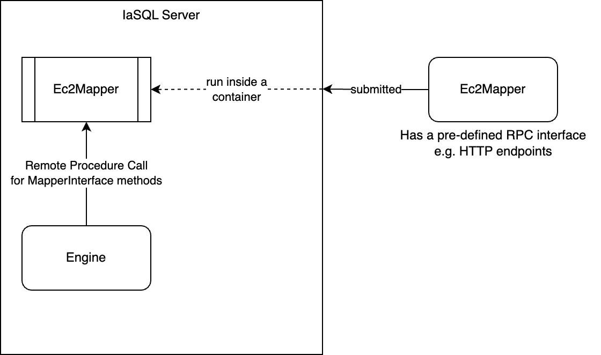

# 007 - Alternative Ways to Create Mappers

## Current Status

### Proposed

2023-02-07

### Accepted

YYYY-MM-DD

#### Approvers

- Full Name <email@example.com>

### Implementation

- [ ] Implemented: [One or more PRs](https://github.com/iasql/iasql-engine/some-pr-link-here) YYYY-MM-DD
- [ ] Revoked/Superceded by: [RFC ###](./000 - RFC Template.md) YYYY-MM-DD

## Author(s)

- Mohammad Teimori Pabandi <m@iasql.com>

## Summary

Having Pure-SQL modules would help us expand more. One key advantage is that we don't need a PR on our engine to add coverage for a new service, we just use a syntax like this and everything JustWorks™.
```postgresql
SELECT iasql_install('https://github.com/someModuleDeveloper/awsEc2Module');
```

We already have the `aws_ecs_simplified` module, and it's written purely in SQL, but it does not add a new mapper functionality. It maps a new entity to the entities that already exist, therefore leveraging those entities' mappers. Specifically, `ecs_simplified` and other modules like it can only reduce down the functionality that has been already exposed through mappers we have written, it can't go beyond any functionality we didn't hand-expose, which makes us the bottleneck for the whole ecosystem.

In this RFC we'll explore different ways to create a mapper, with an eye on being able to create "detachable" mappers that can be decoupled from the engine codebase and make it easier for developers to create new mappers. That has other values, like it will clear the way for development of an ecosystem for modules. Summarizing pros for this approach, we can say it:
- Enables 3rd Party Modules for an actual user ecosystem to exist.
- Reduces pressure on us to cover 100% of all AWS services before getting our first customer, because users can customize their modules to their own needs.
- Potentially improves development/testing turn-around times by segmenting the engine testing from module testing (changes to a module would only trigger tests within the module's repo, changes to the engine would still trigger all officially-supported modules for testing, but would potentially be done much less often, and primarily for confirming newer version(s) of the AWS SDK still work with our modules.
- Adding support for other clouds/SaaSes would be simpler within the engine.

## Definition of Mapper

To create a module, we need a mapper. I'll continue this RFC with my proposed solution for mappers, since a module is a set of mappers, and entities (with a bit of oversimplification).

First, let's see what we need to create a mapper:
- A cloud id function
- An equality checker function
- An entity, that the mapper manages it
- Cloud CRUD functions
- Ability to call other mappers' CRUD functions

We need to get the mapper-like behavior working. I'll explain some ways we might consider for that purpose.

- Remote Mappers
  - Mappers maintained inside IaSQL infrastructure
  - Mappers maintained outside IaSQL infrastructure
- In-IaSQL-Container Mappers
  - Mapper Logic Inside IaSQL Engine
  - Mapper Logic Inside Postgres

## A Stand-Alone Mapper Design (Remote Mappers)

We can run standalone versions of mappers. A standalone mapper means that its logic won't be inside the Postgres, nor in the engine code. But it'll run anywhere outside these two places. Therefore, we need a communication mechanism for this design (which can be something like gRPC, or HTTP as in other places). We also might want to run that standalone mapper on our own server, or on somewhere else. Two approaches:

1. Standalone mappers are served on the IaSQL server: the mapper is submitted to our system, and we'll run it in a container. Then our engine will communicate with that mapper through a communication mechanism. This reduces latency, since the calls will be intra-network, but adds the burden of maintaining the standalone mappers to our side.

2. Standalone mappers served on servers other than IaSQL: the mapper providers can host that mapper anywhere, and provide endpoints to the engine which will be called. This keeps the maintenance of the mapper on the mapper developer side, but increases the latency of mapper.


In the 2nd way, we should post the AWS credentials to the mapper through the internet, which should be done in a secure way. In both ways I don't see another possible approach than posting the AWS credentials to the mapper, since it needs them to query AWS APIs. Anyway, we should warn people to not use a mapper from untrusted authors, because the credentials will be shared with them.

A positive point for having standalone mappers is that it's language agnostic: mapper developers can write the logic in whatever language they want, and it's fine, until they follow the guidelines for the Engine -> Mapper communication protocol.

One negative point is that they'll be provided with the AWS credentials, and they can perform out-of-band data extraction on it on both of the above ways. The security profile for this approach is the worst of all.

The other issue with this way is that it'll be at least as hard as the ways under [Mapper Logic Inside Postgres](#Mapper-Logic-Inside-Postgres) section. So we need a "virtual" mapper to be created and the calls to that mapper should be funneled into these standalone mappers. Also, at the module level we need the entity creation logic (and uninstall logic, of course) to somehow be transmitted to the engine. Given all these, together with the security issues that are purely "wild west situation", I don't think if this would be a good approach neither in the short, nor in long term.

## In-IaSQL-Container Mappers

In this approach, the logic of the mappers will be executed on IaSQL: either on the Postgres server or on the Engine. Our current mappers are under this category.
- Mapper logic is in IaSQL engine: `aws_acm`'s `CertificateMapper`, `aws_ecr`'s `RepositoryImageMapper`, etc.
- Mapper logic is in Postgres server: This is where we initially called Pure-SQL module. Note that `aws_ecs_simplified` module can't be considered under this category, since it introduces no new mappers. It's playing in module-level (not mapper level) and handling a new Entity using already-existing mappers.

Before diving into "Pure-SQL Modules" category, first let's see if our current mappers are surjective to the space of "Mapper logics inside IaSQL engine".

### Mapper Logic Inside IaSQL Engine

Currently, we're developing our mappers in this category. But there might be other ways to integrate the logic inside the engine, without having to exactly follow our current pattern. I'm getting inspired by [Strapi](https://github.com/strapi/strapi), which is a headless CMS. You can create models using a GUI from Strapi's admin panel and the database will be changed on-air, new API routes will be added with proper logic, and it achieves these without losing performance or being in need of pushing new files to the codebase (but the codebase is changing on-air).

So we can get inspired and create on-air mapper codes. But to ensure safety, we might take one of the two approaches: either by narrowing down the available variables, or the by narrowing down the available functionality.
- Create a sandbox and run mapper's JavaScript code on IaSQL engine: in that sandbox, we can narrow down the context and not pass variables that might cause problems.
  - One issue that comes to my mind is that we will be vulnerable to SSRF attacks, which can be dangerous [in EC2](https://scalesec.com/blog/exploit-ssrf-to-gain-aws-credentials/). Our other vulnerability to SSRF would be related to the engine's Express server, which will be accessible by the running code. Therefore, we can't let that code use `fetch` API, `fs` API, or any other APIs that might cause issues. 
  - One way is to use VM2 to run the module code on a separate process, and provide an event-based API into and out of the worker. We could expose something similar to the `invoke_` functions in Postgres as events and event payloads (also including a worker-defined unique token) and they call the same named event back into the worker with the result.
  - This would be much safer as a pure JS context not allowed to require or import anything, but is a very awkward experience for the authors. That awkwardness can be alleviated somewhat by providing our own SDK to take more normal-looking Typescript that automatically has some implicit global functions baked in and then generating the JS bundle out.
  - We won't pass the AWS credentials to the script provided by the developer. We'll provide an interface like `invoke_*` functions so that when the code needs to query the cloud or the database, it can do a message-passing with the parent process.
  - The entities and Postgres upgrade/downgrade code could also be written using this IaSQL SDK and perhaps structured fairly closely to the current module code.
- Providing a new "safe" Domain Specific Language for IaSQL: developers can use this language to create new mappers, and we can translate that to JavaScript code on-air, while narrowing down the DSL interface to something that is "safe" (no code-execution, no unwanted database access, etc.). The DSL does not have to be capable of creating all possible mappers (at least not at first) since if they want to do something very professional, they can just submit a PR to the engine.
  - For example: we can supply a base provider like AWS. And using DSL people can dynamically invoke AWS client's methods and write their logic. The DSL then gets parsed and converted to JavaScript code, and we'll use its interface when we need the mapper.
  - The biggest problem with DSLs, are that the module developers should learn a new language that does not help them anywhere else.


### Mapper Logic Inside Postgres

#### Using Triggers Together With `aws_sdk`

Now that we have `aws_sdk` module, we can simply call whatever AWS SDK call we want. So why not just add some Postgres triggers in case a `INSERT`, `UPDATE`, or `DELETE` happens?

I can think of some downsides to this approach:
1. What about the `cloud.read` functionality? It should be called from time to time. You may think that we can expose a `{entity}_cloud_read` Postgres function (as in the next solution) that is periodically called by the engine, and the result of that function will be used to populate the entries in the entity table. That works. But combined with the next bullet points, seems like it's becoming pretty much like "Exposing Mapper-Like Postgres Interface" option.
2. If we don't tie the `cloud.read` functionality to the engine's inner loop (like syncing from time to time by a cronjob trigger independently), problems related to eventual consistency will arise. Then some parts of the data will be synced, while the other parts may not be up-to-date with the cloud state. That might seem like a small thing at the first sight, but would break things in the long run. For example, we depend on the "Vpc" entity being up-to-date at some point from the "Subnet" mapper. So the subnet mapper keeps throwing errors until the Vpc is synced, then it'll proceed. That functionality is available because both of them are interplaying in the engine's inner loop. I can't see of an easy way to ensure data consistency in some points in time while having two independent cloud sync procedures (engine's inner loop vs cronjob for Pure-SQL modules in this case).
   - If there's no interplay between the Pure-SQL mapper and the engine's inner loop, it's not possible to have co-dependency between different entities (as in Vpc <-> Subnet).
3. For `INSERT`, let's suppose we are using triggers for doing the cloud manipulation. If there's a transaction already open, we'll need to differ the changes until the transaction is being committed. But there's no communication between the engine and the mapper, right? So we should somehow "wait" for the transaction to be committed and then apply the changes, but we can't! If we add a `get_transaction_lock` in the beginning of the `cloud_create` trigger, it'll take forever and the `INSERT` statement [won't return](https://stackoverflow.com/a/48566996/2594912) until it's happened on the cloud. If we don't, we need another cronjob to periodically check and therefore replicating the engine's loop logic inside Postgres to make it work.  
4. We'd need to replicate the engine's diff checker (+ cloud id) logic in Postgres to be able to update an entry when a change comes from the cloud. That's going to add more complexity to the implementation of this approach.

Given all above bullet points, I think this approach hasn't a merit compared to the "Exposing Mapper-Like Postgres Interface" way. It has complexities that option has, and does not provide a better way for the issues that one introduces.

#### Exposing Mapper-Like Postgres Interface

We can put the mapper's logic inside Postgres. And then provide an interface for the engine to call mapper functions. In this approach, the interface will be provided through the Postgres, and therefore this is the approach that is most consistent with "Pure-SQL". The DSL idea from the above way can still be applied here (developer writes DSL, PL/pgSQL code is generated).

So let's consider one possible implementation of the mapper structure (all as Postgres functions):
- CloudId: `{entity}_cloud_id(object: json) -> string` a Postgres function that takes the object as json and returns its cloud id as string.
- Equals: `{entity}_equal(o1: json, o2: json) -> boolean`
- CRUD functions:
    - `{entity}_cloud_create(object: json)`
    - `{entity}_cloud_read() -> json list`
    - `{entity}_cloud_update(old: json, new: json)`
    - `{entity}_cloud_delete(object: json)`
- Call other mappers: 
  - `call_mapper('{module_name}', '{entity_name}', 'cloud|db', 'create|read|update|delete', {}::json) -> json`
  - It would be easy to add support for normal modules with the above definition. It will call `ec2_cloud_read` if that Postgres function exists. Otherwise, it'll send an RPC to the engine to ask engine to call that function from the mapper.

We can also consider the above functions to be strongly-typed inside Postgres. More info here:
https://rounded-apology-58d.notion.site/What-Does-a-Mapper-Need-9402ce7e35244405876f4cf660365c86

##### Security Can't Be Guaranteed
In the Pure-SQL way, it's not easy to guarantee security. Suppose this scenario:
> We have a new Pure-SQL module. It has access to do `INSERT`s and `SELECT`s on behalf of the user. So it can create a CodeBuild project that calls a curl, with the AWS credentials coming from the `aws_credentials` table, right? So I think security can't be guaranteed in neither of the above ways, given our tables keep the current permissioning system.

One way to fix the above issue, is to create a new Postgres role for each user (like `{username}_module`) which will be used by the Pure-SQL modules to execute SQL commands. It won't have access to the `aws_credentials` table.

But the above idea can be also bypassed:
> Use `aws_sdk` module to create a new set of AWS AccessKeyId and SecretAccessKey. Then create a CodeBuild project to send them to the malicious endpoint :D.

Being explicit about module capabilities and dependencies up-front can help mitigate this. A third party module that depends on CodeBuild and AWS account key management APIs should declare that it needs these things and if they seem incongruous to the purpose of the module that's another flag for users.

We could also classify certain API calls as requiring manual confirmation because of their sensitivity (particularly the AWS credential management APIs, but also anything that allows arbitrary code execution, such as CodeBuild or even the startup script you can give to an EC2 instance) as further hardening in the future.

### Common Parts
We also need these added functionalities in order for any of the above solutions to work:
- Dynamically creating a mapper that provides the same interface as `MapperBase`, but calls corresponding SQL functions.
- Registering/de-registering logic for the module entities be transmitted to the engine: security concerns here, since the module should not be able to `DROP` tables for other modules (for example).
- Dependency declaration mechanism: each module should tell IaSQL engine which modules it needs to work properly. And we should be able to get user's manual approval in case it's using sensitive modules. 

## Expected Semver Impact

A minor update. Just adding some Postgres functions, the ability to install a Pure-SQL module from remote link, and the engine having the ability to work with Pure-SQL modules. 

## Affected Components

Mostly the engine

## Expected Timeline

I believe it takes at least 2 weeks for us to create a working example of this and port an easy module to it.