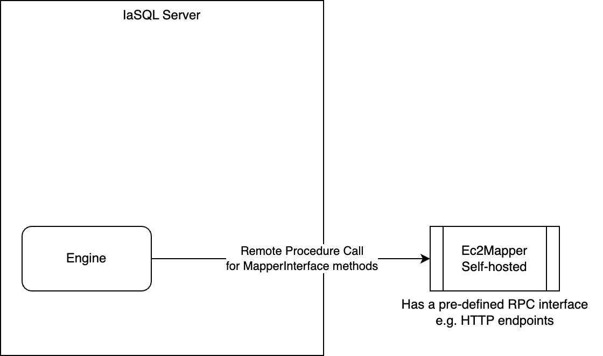

# 007 - Pure SQL Modules

## Current Status

### Proposed

2023-02-07

### Accepted

YYYY-MM-DD

#### Approvers

- Full Name <email@example.com>

### Implementation

- [ ] Implemented: [One or more PRs](https://github.com/iasql/iasql-engine/some-pr-link-here) YYYY-MM-DD
- [ ] Revoked/Superceded by: [RFC ###](./000 - RFC Template.md) YYYY-MM-DD

## Author(s)

- Mohammad Teimori Pabandi <m@iasql.com>

## Summary

Having Pure-SQL modules would help us expand more. One key advantage is that we don't need a PR on our engine to add coverage for a new service, we just use a syntax like this and everything JustWorks™.
```postgresql
SELECT iasql_install('https://github.com/someModuleDeveloper/awsEc2Module');
```

## Proposal

To create a Pure-SQL module, we need a Pure-SQL mapper. I'll continue this RFC with my proposed solution for having Pure-SQL mappers, since a module is a set of mappers.

First, let's see what we need to create a mapper:
- A cloud id function
- An equality checker function
- An entity, that the mapper manages it
- Cloud CRUD functions
- Ability to call other mappers' CRUD functions

We need to get the mapper-like behavior working in Postgres. I'll explain some ways we might consider for that purpose.

### A Stand-Alone Mapper Design

We can run standalone versions of mappers. A standalone mapper means that its logic won't be inside the Postgres, nor in the engine code. But it'll run anywhere outside these two places. Therefore, we need a communication mechanism for this design (which can be something like gRPC, or HTTP as in other places). We also might want to run that standalone mapper on our own server, or on somewhere else. Two approaches:

1. Standalone mappers are served on the IaSQL server: the mapper is submitted to our system, and we'll run it in a container. Then our engine will communicate with that mapper through a communication mechanism. This reduces latency, since the calls will be intra-network, but adds the burden of maintaining the standalone mappers to our side.

2. Standalone mappers served on servers other than IaSQL: the mapper providers can host that mapper anywhere, and provide endpoints to the engine which will be called. This keeps the maintenance of the mapper on the mapper developer side, but increases the latency of mapper.


In the 2nd way, we should post the AWS credentials to the mapper through the internet, which should be done in a secure way. In both ways I don't see another possible approach than posting the AWS credentials to the mapper, since it needs them to query AWS. Anyway, we should warn people to not use a mapper from untrusted authors, because the credentials will be shared with it.

A positive point for having standalone mappers is that it's language agnostic: mapper developers can write the logic in whatever language they want and it's fine, until they follow the guidelines for Engine -> Mapper communication.

One negative point is that they'll be provided with the AWS credentials, and they perform out-of-band extraction on it on both of the above ways.

### Intra-Postgres Mappers
We can put the mapper's logic inside Postgres. And then provide an interface for the engine to call mapper functions. In this approach, the interface will be provided through the Postgres, and therefore this is the approach that is more consistent with "Pure-SQL".

So let's consider this implementation of the mapper structure (all as Postgres functions):
- CloudId: `{entity}_cloud_id(object: json) -> string` a Postgres function that takes the object as json and returns its cloud id as string.
- Equals: `{entity}_equal(o1: json, o2: json) -> boolean`
- CRUD functions:
    - `{entity}_cloud_create(object: json)`
    - `{entity}_cloud_read() -> json list`
    - `{entity}_cloud_update(old: json, new: json)`
    - `{entity}_cloud_delete(object: json)`
- Call other mappers: 
  - `call_mapper('{module_name}', '{entity_name}', 'cloud|db', 'create|read|update|delete', {}::json) -> json`
  - It would be easy to add support for normal modules with the above definition. It will call `ec2_cloud_read` if that Postgres function exists. Otherwise, it'll send an RPC to the engine to ask engine to call that function from the mapper.

We also need some other things:
- Dynamically creating a module that provides the same interface as `MapperBase`, but calls corresponding SQL functions. 

### Alternatives Considered

I also considered the functions to be strongly-typed inside Postgres. More info here:
https://rounded-apology-58d.notion.site/What-Does-a-Mapper-Need-9402ce7e35244405876f4cf660365c86

## Expected Semver Impact

A minor update. Just adding some Postgres functions, the ability to install a Pure-SQL module from remote link, and the engine having the ability to work with Pure-SQL modules. 

## Affected Components

Mostly the engine

## Expected Timeline

I believe it takes at least 2 weeks for us to create a working example of this and port an easy module to it.